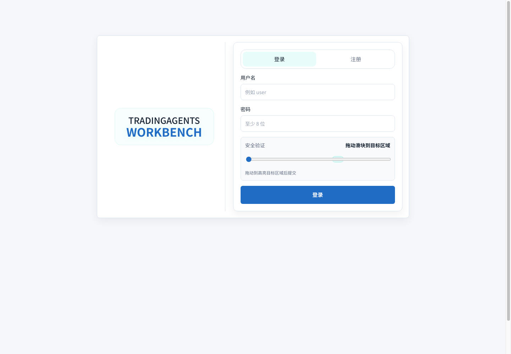
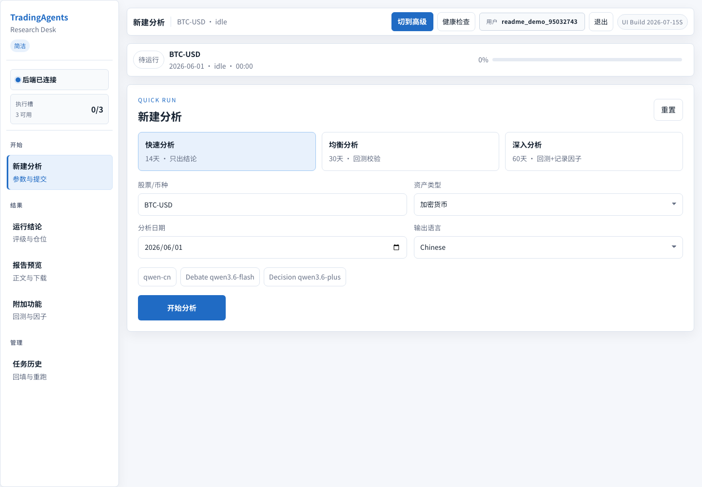

# TradingAgents MyVersion

这是一个基于 TradingAgents 改造的量化研究与多 Agent 交易分析项目。当前版本重点不再只是命令行研究框架，而是围绕 Web Workbench、因子库、Alpha Mining、报告评估、回测、纸面交易、结论跟踪和执行过程可观测性，做成一个更适合日常研究、演练和复盘的工作台。

本项目仅用于研究和策略分析，不构成投资建议。

## 当前版本做了什么

- 新增 Web Workbench：提供登录、任务创建、历史任务、执行编排、Agent 输出、报告预览、日志、回测和评估结果查看。
- 新增多用户系统：支持用户注册/登录、滑块验证、会话 Cookie、管理员用户管理、用户级任务历史与运行缓存隔离。
- 新增 Factor Manager：在 Research Manager 之后、Trader 之前运行，读取因子库和 Alpha Mining 经验，生成 `factor_score` 参与交易计划前的决策输入。
- 新增 Alpha Mining：支持候选因子生成、变异、评估、历史沉淀和经验摘要。
- 新增报告评估：支持参考报告、HTML/PDF 文本抽取和报告质量评估。
- 新增回测链路：可对交易决策做持有期验证，并在 Workbench 中展示回测结果。
- 新增 Paper Trading：支持纸面账户、手动下单、历史结论回放、佣金/滑点模拟和账户绩效曲线。
- 新增结论跟踪：可把分析结论沉淀为观察对象，跟踪状态、复盘窗口、模拟结果和最终验证结论。
- 新增推演模拟盘：支持对未来观察期做情景模拟，记录 forecast episode，并可选择同步写入纸面账户。
- 新增运行指标：记录 LLM 调用、Tool 调用、Token、耗时、Agent 阶段和事件，方便定位任务卡住或输出缺失。
- 增强数据链路：补充加密货币工具、中文零售代理数据、社交数据 fallback、非美资产和中文输出支持。
- 优化执行策略：Hold 决策不会再产生默认仓位，仓位逻辑集中到执行策略层处理。
- 优化前端体验：参考 Tabler 风格整理工作台布局、统一字体、简化执行编排视图，并修复 Factor Manager 实时输出展示。
- 优化 Docker 部署：增加 `tradingagents-workbench` 服务，方便直接启动 Web 操作台。

## 页面截图

登录页包含注册/登录切换、密码校验和滑块验证：



登录后的 Workbench 主界面包含用户信息、执行槽、任务配置、导航和运行状态：



## 执行流程

当前分析任务的大致流程是：

```text
创建任务
  -> Analyst Team 生成市场/情绪/新闻/基本面分析
  -> Bull Researcher / Bear Researcher 辩论
  -> Research Manager 汇总研究结论
  -> Factor Manager 读取因子库并生成 factor_score
  -> Trader 生成交易计划
  -> Risk Team 做风险辩论
  -> Portfolio Manager 给出最终决策
  -> 报告、回测、评估、纸面交易、结论跟踪、历史沉淀
```

因子库不是替代 LLM 研究过程，而是在研究经理形成结论后，把历史因子、Alpha Mining 经验和当前上下文转成结构化评分，再交给 Trader 作为交易计划前的额外证据。

## 项目结构

```text
.
├── cli/
│   ├── main.py                 # 交互式 CLI 主入口
│   ├── alpha_flow.py           # Alpha Mining CLI 流程
│   ├── backtest_flow.py        # 回测 CLI 流程
│   ├── report_helpers.py       # 报告辅助逻辑
│   └── report_io.py            # 报告读写逻辑
├── frontend/
│   ├── index.html              # Workbench 页面入口
│   ├── app.js                  # Workbench 前端逻辑
│   ├── styles.css              # Workbench 样式
│   ├── server.py               # Workbench 轻量后端服务
│   └── workbench_api_paths.py  # Workbench API 兼容路径别名
├── tradingagents/
│   ├── agents/                 # 分析师、研究员、交易员、风险和管理类 Agent
│   ├── alpha_mining/           # 因子挖掘、候选生成、变异、评估和经验摘要
│   ├── backtesting/            # 回测引擎
│   ├── conclusions/            # 研究结论跟踪、生命周期和复盘摘要
│   ├── content_discovery/      # 参考内容发现
│   ├── core/                   # 运行指标、时间上下文等核心工具
│   ├── dataflows/              # 市场、社交、中文代理和加密货币数据链路
│   ├── decisioning/            # 执行策略、因子评分和风险门控
│   ├── evaluation/             # 报告评估和参考文本抽取
│   ├── graph/                  # LangGraph 编排、传播和状态日志
│   ├── llm_clients/            # LLM 客户端适配
│   └── papertrading/           # 纸面交易账户、成交、episode ledger 和绩效分析
├── tests/                      # Workbench、因子、回测、报告、数据链路和运行指标测试
├── docker-compose.yml          # CLI / Workbench / Ollama 容器编排
├── Dockerfile
├── pyproject.toml
└── README.md
```

## 本地启动

安装依赖：

```bash
python -m venv .venv
source .venv/bin/activate
pip install .
```

如果需要运行测试和开发工具，安装开发依赖：

```bash
pip install ".[dev]"
```

启动 CLI：

```bash
python -m cli.main
```

启动 Web Workbench：

```bash
python -m frontend.server
```

## Docker 启动

准备环境变量：

```bash
cp .env.example .env
```

启动 Web Workbench：

```bash
docker compose up -d tradingagents-workbench
```

启动 CLI 容器：

```bash
docker compose run --rm tradingagents
```

如需 Ollama：

```bash
docker compose --profile ollama up -d ollama
docker compose --profile ollama run --rm tradingagents-ollama
```

## 配置说明

常用配置来自 `.env`、`DEFAULT_CONFIG` 和 Workbench 表单。支持的模型供应商包括 OpenAI、Qwen、GLM、MiniMax、DeepSeek、OpenRouter、Ollama、Azure 等。

敏感信息不要提交到 Git：

- `.env`
- API key
- 登录账号、cookie、token
- `.tradingagents/` 运行缓存和历史
- 本地报告、研报和临时研究材料
- 个人内网地址或代理地址

## 多用户系统

Workbench 内置轻量多用户系统，主要用于多人共用同一套部署时隔离任务和历史数据。

- 注册/登录：支持用户名密码注册和登录，密码使用 PBKDF2 哈希后存储。
- 滑块验证：登录和注册前需要完成滑块验证，避免简单脚本直接撞库。
- 会话管理：登录后通过 HttpOnly Cookie 维持会话，服务端记录会话过期时间。
- 管理员角色：首个注册用户会成为管理员，管理员可查看用户列表、禁用/解锁用户、重置密码和删除用户。
- 用户隔离：不同用户的任务历史、报告路径、缓存和 Workbench 运行数据按 `user_id` 命名空间隔离。
- 登录保护：连续失败会触发短时间锁定，降低暴力尝试风险。

## Workbench 说明

Workbench 的主要模块包括：

- 新建分析：配置标的、日期、资产类型、模型、研究深度、回测、报告评估和 Alpha Mining。
- 执行编排：查看每个 Agent 的状态和输出。
- 结果：查看最终评级、仓位、置信度、因子评分、回测摘要和风险结论。
- 报告预览：查看结构化报告章节。
- 日志：查看运行过程、LLM/Tool 调用和异常信息。
- 历史任务：查看、同步、复用和重新运行历史分析。
- 纸面交易：查看纸面账户、提交手动订单、从历史任务结论回填交易参数，并追踪成交和持仓。
- 历史回放：使用历史真实价格对已有结论或手动交易计划做持有期回放。
- 推演模拟盘：对未来观察期做情景模拟，支持基于历史波动估计、手动 drift/volatility、模拟路径数量和随机种子。
- 结论跟踪：把最终决策、手动观察或推演结果沉淀为可复盘条目，按跟踪中、待复盘、已验证、已失效等状态管理。

Factor Manager 的输出会在实时执行过程中写入任务快照；如果是旧历史任务，后端会尝试从落盘状态日志回填。

## 纸面交易与结论跟踪

Paper Trading 不是实盘交易接口，只用于研究演练和复盘。它会在 Workbench 用户目录下维护本地纸面账户、成交、账户快照和 episode ledger。

主要能力：

- 纸面账户：支持初始资金、目标仓位、买入/卖出/减仓、佣金和滑点设置。
- 历史回放：从历史任务最终决策或手动参数生成纸面订单，用真实历史价格验证持有期表现。
- 推演模拟：当未来真实价格不足时，可按情景参数生成预测路径，并保留真实价格可用后的对照序列。
- 结论生命周期：将研究结论记录为 track，支持 due review、validated、invalidated、exited 等状态和复盘事件。
- Analytics：内置账户收益、回撤、胜率、Sharpe、结论生命周期统计等指标；若本地安装了扩展分析库，也可以继续增强。

相关数据按用户隔离，默认落在 `.tradingagents/workbench_users/<user_id>/` 下，常见文件包括：

- `paper_account.json`
- `paper_episodes.json`
- `conclusion_tracks.json`

Workbench 同时保留一组语义化 API 路径别名，例如 `/api/simulation/forecast/order` 会映射到 `/api/paper/order`，方便前端逐步从旧命名迁移到更清晰的模拟/观察语义。

## 测试与验证

常用快速验证：

```bash
node --check frontend/app.js
python -m py_compile frontend/server.py frontend/workbench_api_paths.py
python -m pytest tests/test_workbench_server_hardening.py tests/test_execution_policy.py tests/test_run_metrics.py tests/test_model_validation.py tests/test_memory_log.py tests/test_structured_agents.py tests/test_time_context_phase1.py -q
```

更完整的相关回归：

```bash
python -m pytest tests/test_alpha_mining.py tests/test_content_discovery.py tests/test_report_evaluation.py tests/test_papertrading.py tests/test_paper_episode_ledger.py tests/test_paper_analytics.py tests/test_paper_market_history.py tests/test_conclusions.py -q
```

## Git 维护

提交前建议检查：

```bash
git status --short
git diff --cached --name-only
```

当前项目已在 `.gitignore` 中排除 `.env`、`.tradingagents/`、`reports/`、`.DS_Store` 等本地文件。推送前仍建议扫描 staged diff，避免误提交 API key、内网地址或本地运行数据。
